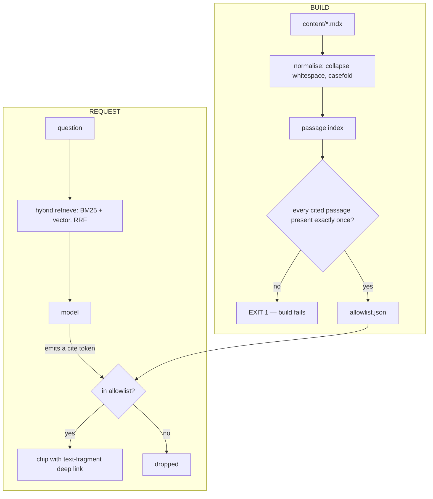

# trigsight

**An AI assistant that cannot make a claim about my work it can't prove.**

Every factual statement it produces is bound at build time to the exact sentence that
supports it. Clicking a citation scrolls the source page to that sentence and
highlights it. If a cited passage does not exist in its source document, **the build
fails** — an unverifiable claim is not shippable.

<!-- SCREENCAST: Act 1 — a general AI search product miscites my own published work.
     Act 2 — the same question here, cited to the exact highlighted sentence.
     Act 3 — CI rejecting a build because one citation went stale. -->

## Why this exists

Portfolio chatbots make claims about their author's competence. A reader has no way to
check them, and good reason not to try: measured citation error rates for general AI
search sit above 60%, and only 51.5% of generated sentences are fully supported by
their cited sources. So the claims get discounted and the feature is decoration.

The usual fix is to ground the model in a corpus and hope. That helps with
hallucination but not with *verification* — the reader still gets a link to a whole
page and has to hunt for the sentence backing the specific claim.

This inverts the trust model. The model never writes a link. It names a passage; the
build resolves it against an index of what the documents actually say, or refuses to
ship.

## Measured results

| | Comparable portfolio | trigsight |
|---|---|---|
| Lighthouse performance (mobile) | 62 | **100** |
| Accessibility · Best Practices · SEO | 100 · 100 · 100 | **100 · 100 · 100** |
| Largest Contentful Paint | 3.9 s | **1.9 s** |
| Total Blocking Time | 1,540 ms | **~20 ms** |
| Initial JavaScript (brotli) | 380.9 KB | **110.4 KB** |
| WebGL scene | none | **shipping** |
| Citations verified against source | — | **34 / 34** |

3.4× less JavaScript *with* a 3D scene running. Both figures measured with the
harnesses in `bench/`, three runs each.

Retrieval, 30 hand-written golden queries at k=5:

| Config | recall@5 | MRR |
|---|---|---|
| Lexical only (BM25) | 0.933 | 0.729 |
| Hybrid (BM25 + vector, RRF k=60) | **0.967** | **0.831** |

## How the guarantee works



The model has no mechanism for producing a URL, so it cannot produce a wrong one.
Prompt instructions are a request; an absent capability is an invariant.

### The part that was harder than it looks

A browser matching `#:~:text=` compares against **rendered** text, and each part of
the directive must sit inside a single element. Two consequences that cost real
debugging:

- Comparing against raw source fails 3 of 7 passages a browser matches fine —
  passages crossing a newline, containing collapsed whitespace, or differing in case.
  A verifier that produces false failures trains you to disable it.
- A passage spanning inline markup renders as separate DOM nodes and cannot be matched
  at all, even though flattened text contains it. Two of 34 citations were in this
  state: reported bound, unmatchable in practice. Caught only by fetching every built
  page and searching its text.

Both are now enforced, with regression tests. The verifier also requires each passage
to appear **exactly once**, disambiguating with a prefix when it does not — otherwise
the browser silently scrolls to the wrong occurrence, a correctness bug that looks
like success.

## Quickstart

```bash
npm ci
npm run dev          # http://localhost:3000
```

No credentials needed. Without `AI_GATEWAY_API_KEY` the chat endpoint returns the
retrieved context instead of an answer, so retrieval is inspectable on its own.

## Verify the claims yourself

```bash
npm run verify:citations                 # the gate: exits 1 on any unbound claim
npx tsx bench/citations/verify.ts --demo # watch it reject a fabricated passage
npm run eval:retrieval                   # recall@5 and MRR over the golden set
./bench/payload/measure.sh 3990 150      # initial JS against the budget
npm test                                 # 91 tests
```

Every number above comes from one of those. `bench/` is committed and never
gitignored — an uncommitted harness turns a real result into an unverifiable claim.

## MCP server

`POST /api/mcp` — stateless Streamable HTTP, spec `2026-07-28`. Four read-only
**verification** tools rather than description tools:

| Tool | Answers |
|---|---|
| `list_work` | What is documented, with metrics flagged verified or not |
| `find_evidence` | What passages support a claim — or plainly that none do |
| `check_stack` | Whether a technology is *discussed in prose* or merely *listed in a stack* |
| `read_work` | Full text of one case study |

`find_evidence` originally confirmed *"quantum cryptography research on ion traps"*. A
vector leg is nearest-neighbour search: it always returns its closest chunks however
unrelated. An agent consuming that would repeat a fabricated credential. It now
requires genuine lexical overlap, calibrated to 8/10 true positives and 0/6 false
positives against hand-written claim sets.

## Limitations

Stated plainly, because a limitations section that reads as marketing is worthless.

- **The vector leg is currently a deterministic hashed-trigram stand-in**, not a
  semantic embedding model. It exists so fusion and budgeting are testable offline
  with no credentials. The eval harness prints this on every run and names the backend
  in its results. Real embeddings will be measured as a third row — and if they don't
  beat 0.967, that is a finding about whether a 25-document corpus needs a vector leg
  at all.
- **Text fragments are fragile by design.** Rewording a cited sentence breaks its
  link. That is the point of the build gate — you cannot ship the breakage — but it
  does mean editing prose sometimes means updating a citation.
- **Citations must sit inside one block element.** A claim best supported by text
  spanning a table row and a paragraph cannot be cited as a single passage.
- **The corpus is small** (6 documents, 34 chunks). Retrieval numbers here should not
  be read as predictions for a large corpus.
- **No streaming citation resolution.** Chips render after a message completes, not
  mid-stream.

## Stack

Next.js 16.3.1 · React 19.2.8 (pinned — R3F 9 peers `>=19 <19.3`) · TypeScript ·
Tailwind v4.3.3 · Velite + Zod · three 0.185.1 + R3F 9.7.0 (pinned) ·
Vercel AI Gateway

## Licence

MIT — see [LICENSE](LICENSE).
