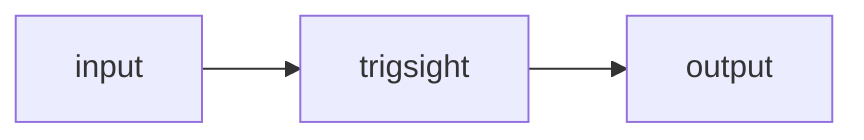

# trigsight

A portfolio's AI layer cannot be trusted: general AI search miscites, and heavyweight sites ship hundreds of KB of JS for no interactive gain.

<!-- SCREENCAST HERE, above the fold. Problem → Solution → Evidence, 60-90s.
     Act 1 shows the failure. A demo that opens on a working feature has no stakes. -->

## The problem, measured

<!-- The number from docs/01-problem.md. Link to the harness. -->

## Quickstart

```bash
# must genuinely run in under 60 seconds
```

## How it works



## Results

<!-- The table from docs/05-results.md. Reproduce with one command. -->

## Limitations

<!-- Honest and specific. What this does not do. -->

## Documentation

| Document | Contents |
|---|---|
| [Problem](docs/01-problem.md) | The measured baseline |
| [Thesis](docs/02-thesis.md) | Falsifiable claim + pre-registered criteria |
| [Architecture](docs/03-architecture.md) | Design and rejected alternatives |
| [Results](docs/05-results.md) | Benchmarks, runs, variance |
| [Writeup](docs/09-writeup.md) | Full technical document |
| [Non-goals](docs/NON-GOALS.md) | Deliberate scope cuts |
| [Deployment](docs/DEPLOYMENT.md) | Running it in production |
| [Decisions](docs/DECISIONS.md) | Running decision log |

## Licence

MIT — see [LICENSE](LICENSE).
