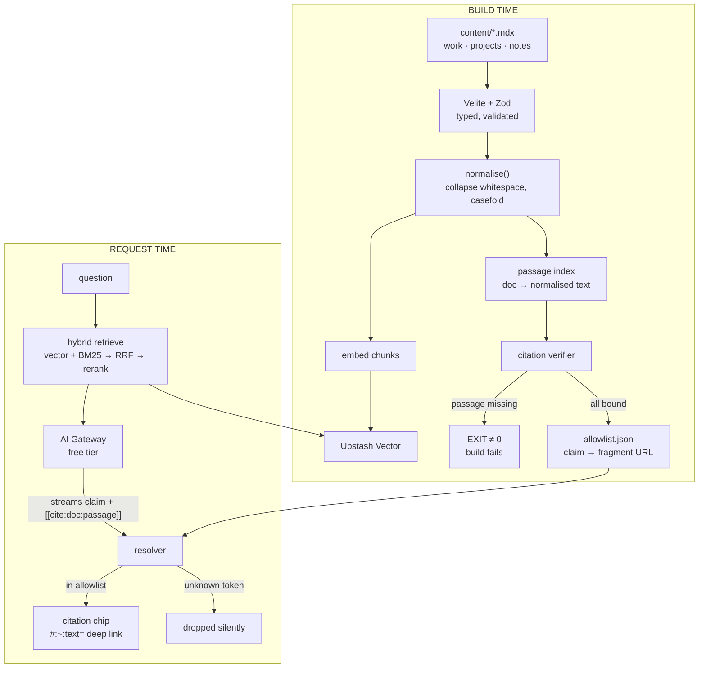

# 03 — Architecture

> **Gate:** reviewed and approved before implementation begins.

## The one idea

Everything else here is conventional. The novel part is a single invariant:

> **A citation cannot render unless its quoted passage provably exists in the cited document,
> verified at build time against the same normalised text the browser will match.**

The model is never trusted to produce a URL. It produces a claim plus a passage reference; the build
produces the URL, or the build fails.

## Diagram

## The verifier — normalisation is the whole problem

I probed the matching semantics before designing this (7 cases, `node`). The finding that shapes the
design:

| Case | Raw-source match | Browser (normalised) match |
|---|---|---|
| Exact phrase | ✅ | ✅ |
| Passage crosses a newline in the MDX | ❌ | ✅ |
| Source has multiple consecutive spaces | ❌ | ✅ |
| Case differs | ❌ | ✅ |
| Smart quotes / em dash | ✅ | ✅ |
| Text genuinely absent | ❌ | ❌ |

**A naive verifier grepping raw MDX would fail 3 of 7 passages the browser matches correctly** —
producing false build failures, which would train me to disable the gate and defeat the entire thesis.
So the verifier normalises exactly as the browser does:

1. Render MDX → HTML → extract `textContent`. The browser matches *rendered* text, not source.
2. Collapse whitespace runs to a single space; trim.
3. Casefold — matching is case-insensitive per spec.
4. Preserve punctuation verbatim; smart quotes and em dashes match and must not be mangled.
5. Assert the passage exists **exactly once**. A passage appearing twice scrolls to the wrong
   instance — a silent correctness bug the spec explicitly warns about.
6. Assert it lies wholly within one block-level element (spec constraint).
7. Percent-encode, including `-` → `%2D`, which the spec requires and is easy to miss.

**Ambiguity is disambiguated, not rejected:** where a passage is not unique, emit the
`prefix-,textStart,-suffix` form.

## Components

| Component | Responsibility | Criterion |
|---|---|---|
| `content/` + Velite/Zod | One typed content source; six derivations (pages, chat corpus, graph model, MCP tools, `.md` variants, JSON Resume) | — |
| `lib/normalise.ts` | The single normalisation function, shared by verifier, indexer and resolver so all three agree by construction | 1 |
| `lib/passage-index.ts` | Build-time index of every document's normalised text | 1 |
| `bench/citations/verify.ts` | The gate. Asserts every citable claim binds; emits `allowlist.json` or exits non-zero | 1, 2 |
| `lib/retrieve.ts` | Hybrid: Upstash Vector + BM25 over the same chunks → RRF → rerank | 3 |
| `app/api/chat/route.ts` | AI Gateway; streams claims plus `[[cite:doc:passage-id]]` tokens only | 3, 6 |
| `components/citation-chip.tsx` | Resolves tokens against `allowlist.json`; unknown tokens dropped | 1, 2 |
| `app/api/mcp/route.ts` | Stateless MCP (2026-07-28 spec), read-only verification tools | — |
| `scene/` | One curated R3F scene: lazy, TSL shaders, `frameloop="demand"` | 4 |
| `bench/` | `baseline/` `citations/` `retrieval/` `payload/` — all committed | 3, 4, 5 |

## Data flow, one request end to end

1. Question → `POST /api/chat`.
2. Embed the query; vector search Upstash + BM25 over the same chunk set; fuse with RRF; rerank; top-k.
3. Prompt the model with retrieved chunks, each carrying a stable `passage-id`. The model is
   instructed to emit `[[cite:doc:passage-id]]` and **never** a URL.
4. Stream to the client through a sanitising markdown pipeline.
5. Each citation token hits the resolver → looked up in `allowlist.json` (built at build time, so every
   entry is already verified) → renders a chip whose href is the `#:~:text=` fragment.
6. Unknown token → dropped silently. The model cannot invent a link because it cannot emit one.

## Decisions

| Decision | Chosen | Rejected | Why | What would change it |
|---|---|---|---|---|
| Who builds citation URLs | **Build step, from a verified index** | Model emits URLs; runtime validation | A model emitting URLs can hallucinate one. Runtime validation is too late — the claim already rendered. Build-time makes an unverifiable claim unshippable, which *is* criterion 2. | Nothing; this is the thesis. |
| Verifier input | **Rendered, normalised `textContent`** | Raw MDX source | Probed: raw matching fails 3/7 cases browsers accept. False failures would train me to bypass the gate. | Browsers changing match semantics. |
| Citation granularity | **Passage (`#:~:text=`)** | Page anchor; section `#id` | Page-level is the measured gap. Section anchors are the documented fallback under kill condition 1. | Fragments proving impractical at scale. |
| Ambiguous passages | **`prefix-,text,-suffix`** | Reject the citation | Spec warns the browser silently scrolls to the wrong instance. Disambiguating keeps information; rejecting loses it. | — |
| Vector store | **Upstash Vector** via `vercel install upstash` | pgvector on Neon; sqlite-vec in-repo | Vercel has no native vector DB. Upstash provisions through Vercel's own CLI with auto-injected credentials — one ecosystem, inside free tier (10K queries/day ≫ portfolio traffic). | Free-tier terms changing. |
| Retrieval | **Hybrid + RRF + rerank** | Vector only; stuff the whole corpus | The corpus is ~25 docs, so stuffing would plausibly work — which is exactly why hybrid must be *measured*, not assumed. No gain triggers kill condition 3 and a publishable negative result about small-corpus RAG. | Measurement showing no gain → report it. |
| Renderer | **WebGL2, shaders in TSL** | WebGPU | Firefox WebGPU is Windows-only. TSL compiles to both GLSL and WGSL, making this a later swap not a rewrite. | Broad WebGPU support. |
| Scroll animation | **GSAP ScrollTrigger** | Native CSS `animation-timeline` | Native is Chrome+Safari only; Firefox still "preview". | Firefox shipping it stable. |
| Content layer | **Velite** | Contentlayer; fumadocs | Contentlayer is abandoned. Velite's Zod validation is what makes the passage index type-safe. | — |
| MCP transport | **Stateless POST** (2026-07-28) | Session-based + SSE resumability | Removed from the spec. Stateless needs no Redis and no Durable Objects — one route handler. | Spec revision. |

## Structural invariant test

Beyond the citation gate, one test asserts the **content ↔ derivation bijection**: every document in
`content/` appears in the chat corpus, the graph model and the MCP tool output, and nothing appears in
a derivation that is not in `content/`. A silently-dropped document would otherwise yield a site that
looks complete and is not.

## What is deliberately conventional

Next.js App Router, Tailwind, MDX, streaming chat, Vercel deploy. All standard, chosen so effort
concentrates on the one novel invariant rather than re-inventing a framework.

## Verified before designing (2026-08-21)

| Assumption | Status |
|---|---|
| Text fragments are a real, supported mechanism with graceful degradation | ✅ Unmatched fragments are ignored; browser loads top of document |
| Feature-detectable at runtime | ✅ `document.fragmentDirective` |
| Matching is case-insensitive; passages may span element boundaries but each part must sit in one block | ✅ Per spec |
| `-` must be percent-encoded | ✅ Per spec |
| Sites can opt out via `Document-Policy: force-load-at-top` | ✅ Noted — we must not send it |
| Fragments are fragile if source text changes | ✅ **This is precisely why the build-time gate exists** — content edits that orphan a citation fail the build |
| Stack versions live on npm | ✅ next 16.3.1 · react 19.2.8 · three 0.185.1 · R3F 9.7.0 · motion 13.1.1 · velite 0.4.0 · ai 7.0.71 |
| MCP SDK version | ⚠️ `@modelcontextprotocol/sdk` is **1.30.0**, not the `^2` in the research notes. Resolve at implementation. |
