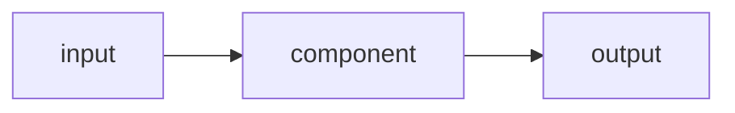

# 03 — Architecture

> **Gate:** reviewed and approved before implementation begins.

## Diagram

## Components

| Component | Responsibility | Notes |
|---|---|---|
| | | |

## Data flow

<!-- Trace one request end to end. -->

## Decisions

| Decision | Chosen | Alternatives rejected | Why | What would change it |
|---|---|---|---|---|
| | | | | |

<!-- Rejected alternatives stay here permanently. A reader learns more from the
     options discarded than from the one chosen. -->
